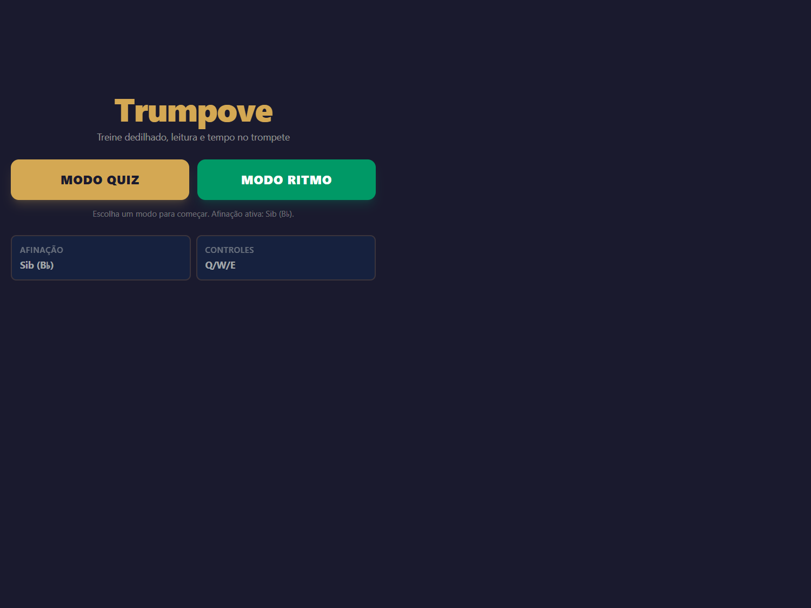
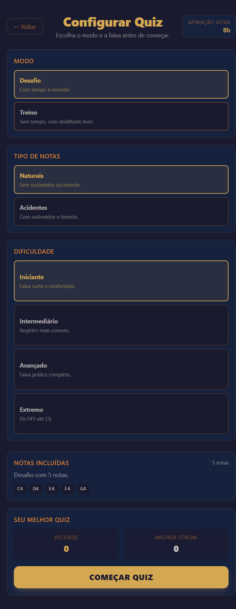
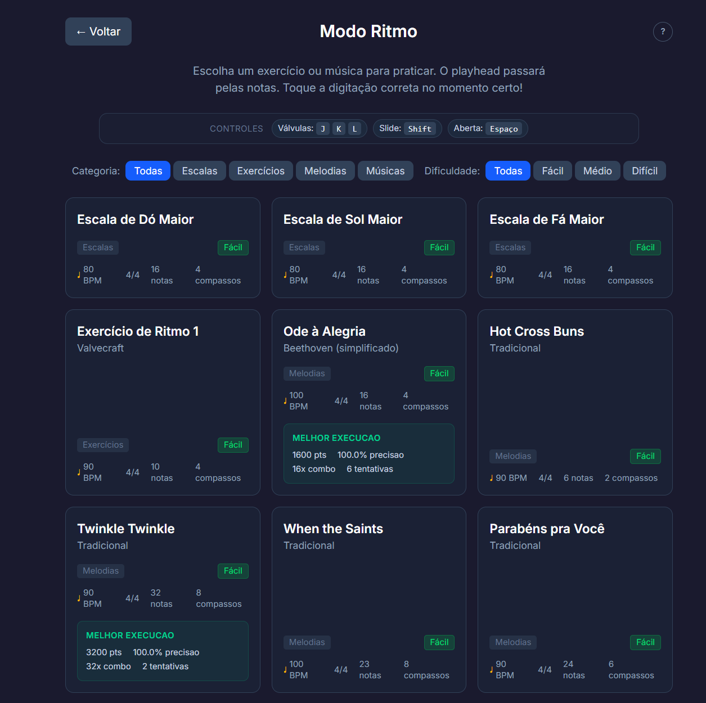
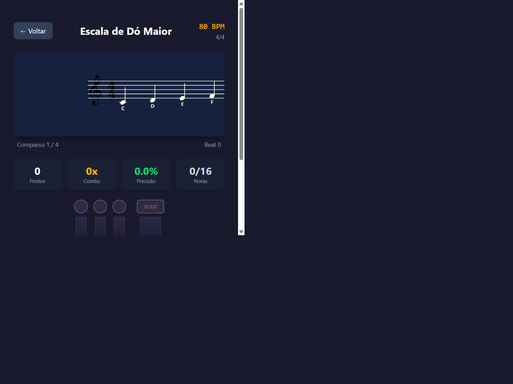

<div align="center">

# 🎺 Valvecraft

**Treine dedilhado, leitura e tempo no trompete direto no seu navegador.**

[](https://react.dev/)
[](https://www.typescriptlang.org/)
[](https://vitejs.dev/)
[](https://tailwindcss.com/)



</div>

## Sobre o projeto

Valvecraft é um jogo educativo para trompetistas que querem melhorar **dedilhado**, **leitura de partitura** e **senso de ritmo** de forma interativa. Com amostras de áudio reais de trompete e feedback visual em tempo real, o jogo transforma o estudo técnico em uma experiência dinâmica.

Suporta **Trompete em Si♭** (padrão) e **Trompete em Dó**.

---

## Modos de jogo

### 🎯 Modo Quiz

Você vê uma nota na pauta e precisa identificar e tocar o dedilhado correto nas válvulas.

| Sub-modo | Descrição |
|---|---|
| **Desafio** | Cronômetro de 60s. Acertos estendem o tempo; erros penalizam. Sistema de streaks com multiplicadores. |
| **Treino** | Sem tempo, com dicas visuais de dedilhado. Ideal para iniciantes. |




#### Configuração do Quiz

Antes de começar, você escolhe:

- **Dificuldade (faixa de notas)**
  | Nível | Faixa |
  |---|---|
  | Iniciante | C4 – G4 |
  | Intermediário | G3 – C5 |
  | Avançado | G3 – G5 |
  | Extremo | F#3 – C6 |

- **Tipo de notas** — Naturais (sem acidentes) ou com sustenidos/bemóis

#### Sistema de Streaks

Acertos consecutivos sobem de nível e aumentam o multiplicador de pontuação:

| Tier | Streak | Multiplicador |
|---|---|---|
| 🔵 Ritmo | 0+ | 1.0× |
| 🟡 Combo | 5+ | 1.15× |
| 🟠 Foco | 10+ | 1.3× |
| 🔴 Blitz | 15+ | 1.5× |

---

### 🎼 Modo Ritmo

Toque músicas reais em partitura. Um playhead percorre as notas no tempo certo — você deve pressionar as válvulas corretas no momento exato.






**Repertório disponível:**

| Categoria | Títulos |
|---|---|
| Escalas | Dó Maior, Sol Maior, Fá Maior |
| Exercícios | Exercício de Ritmo 1 |
| Melodias | Ode à Alegria, Hot Cross Buns, Twinkle Twinkle, When the Saints, Parabéns pra Você, Amazing Grace, e mais |

Feedback por nota:
- 🟢 **Perfeito** — dedilhado correto no tempo
- 🟠 **Dedilhado errado** — tempo certo, nota errada
- 🔴 **Miss** — janela de tempo perdida

---

## Controles

| Ação | Teclado (padrão) |
|---|---|
| Válvula 1 | `Q` |
| Válvula 2 | `W` |
| Válvula 3 | `E` |
| 3º slide (correção de afinação) | `Shift` |
| Confirmar / Nota aberta | `Espaço` |

> Os controles podem ser alterados no menu principal.

---

## Instalação e execução

### Pré-requisitos

- [Node.js](https://nodejs.org/) 18+
- npm ou yarn

### Passos

```bash
# Clone o repositório
git clone https://github.com/Alanlan21/valvecraft.git
cd valvecraft

# Instale as dependências
npm install

# Inicie o servidor de desenvolvimento
npm run dev
```

Acesse `http://localhost:5173` no navegador.

### Build para produção

```bash
npm run build
```

---

## Stack tecnológica

| Tecnologia | Uso |
|---|---|
| [React 19](https://react.dev/) | Interface e componentes |
| [TypeScript](https://www.typescriptlang.org/) | Tipagem estática |
| [Vite 6](https://vitejs.dev/) | Build e dev server |
| [Tailwind CSS 4](https://tailwindcss.com/) | Estilização |
| [VexFlow](https://www.vexflow.com/) | Renderização de partituras |
| [Tone.js](https://tonejs.github.io/) | Síntese e amostras de áudio |

---

## Estrutura do projeto

```
src/
├── components/       # Telas e elementos visuais
│   ├── GameScreen        # Tela principal do Quiz
│   ├── RhythmModeScreen  # Tela do Modo Ritmo
│   ├── QuizSetupScreen   # Configuração do Quiz
│   ├── SheetMusicDisplay # Renderização da partitura
│   ├── ValveIndicator    # Indicador visual das válvulas
│   ├── HeatBar           # Barra de streak/calor
│   └── ScoreBoard        # Placar em tempo real
├── data/
│   ├── fingeringMap.ts   # Mapeamento nota → válvulas
│   └── sheets/           # Partituras do Modo Ritmo
├── hooks/
│   ├── useGameEngine     # Lógica central do Quiz
│   ├── usePlaybackEngine # Engine de ritmo/tempo
│   ├── useTrumpetAudio   # Reprodução de áudio (Tone.js)
│   └── useHitDetection   # Detecção de acerto no ritmo
├── types/                # Tipos TypeScript compartilhados
└── utils/
    ├── fingeringMap.ts   # Utilitários de notas
    └── gameRules.ts      # Regras e constantes do jogo
```

---

<div align="center">
Feito com ♪ para trompetistas que levam o estudo a sério.
</div>
